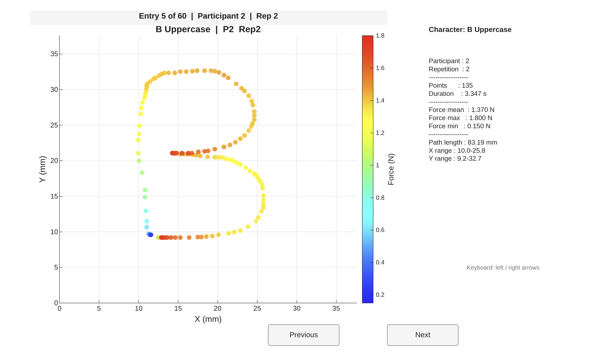
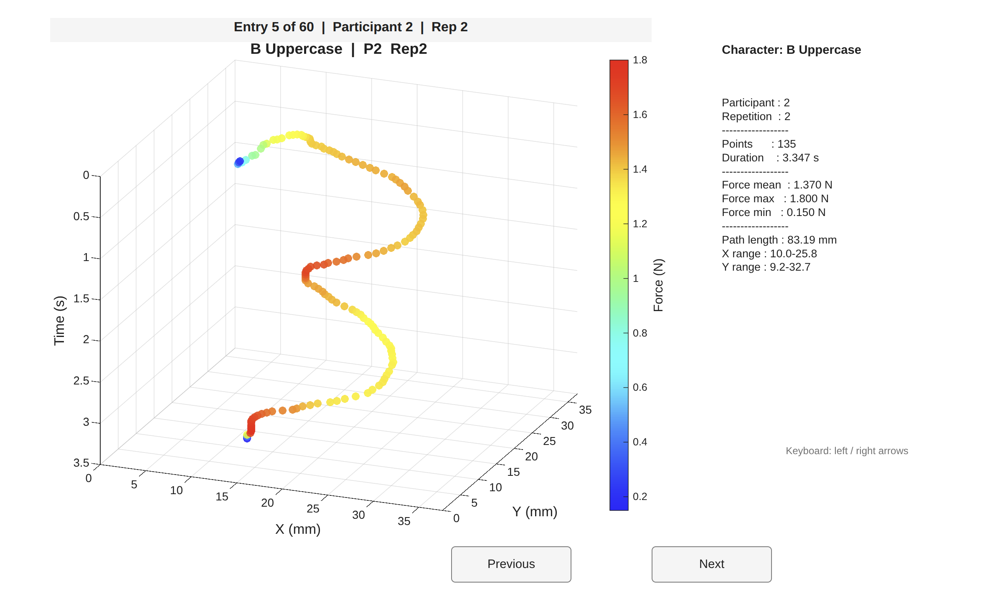

# Trajectory and Force Data for Handwritten Alphabet Generation

This repository contains a dataset of human handwriting trajectory and stylus force recordings for all 26 letters of the Latin alphabet (both uppercase and lowercase), collected through a user study on robot teleoperation via a touchscreen interface. The data is intended to support research in robot learning from demonstration, human-robot interaction (HRI), and trajectory generation for robotic handwriting tasks.

---

## Example Data Visualisations

The figures below show example recordings for the letter **B (Uppercase)** of Participant ID 2 repetition 2 in 2D and 3D views, illustrating both the planar trajectory and the 3D time-depth view. Colour encodes the applied force: **blue = minimum force**, **red = maximum force**.

**Planar view (X–Y with force colour):**



**3D view (X–Y plane facing forward, time increasing into depth):**



---

## Dataset Description

### Collection Setup
- **Interface:** Stylus-based touchscreen teleoperation interface
- **Task:** Participants traced alphabet characters (Font: Inter Regular) displayed on screen, controlling a simulated robot on a 2D surface 
- **Screen:** 13.3-inch display at 3840×2160 resolution (pixel size ≈ 0.077 mm)
- **Active workspace:** 37.59 × 37.59 mm per each square
- **Sampling Rate:** 40 Hz

### Participants
- **Total participants:** 22
- **Eligibility:** Age 18+

### Characters
- **Coverage:** Full Latin alphabet, A–Z
- **Cases:** Uppercase and Lowercase
- **Total character/case pairs:** 52 (one CSV file per pair)
- **Repetitions per participant:** Up to 3 per character (re-indexed sequentially after quality filtering)

### Data Format

Each CSV file (e.g. `A_Lowercase.csv`) contains the following columns:

| Column | Description | Unit |
|---|---|---|
| `participant` | Participant ID number | — |
| `repetition` | Repetition index (1, 2, or 3) | — |
| `x_mm` | Stylus X position on the touchscreen | mm |
| `y_mm` | Stylus Y position on the touchscreen | mm |
| `time` | Time elapsed since the start of this trial | s |
| `force_N` | Normal force applied by the stylus | N |

### Quality Filtering

All trajectories were manually inspected using an interactive MATLAB browser. Trajectories that were incomplete, misaligned, or otherwise not representative of the intended character were removed. Repetition indices were re-assigned sequentially after removal so that repetitions are always numbered 1, 2, 3 with no gaps.

---

## Dataset Statistics

The following statistics were computed across all 3,142 demonstration trajectories after quality inspection, using `Data_Analysis.m` (Section 3).

### Overview

| Metric | Value |
|---|---|
| Character/case pairs | 52 |
| Total demonstration trajectories | 3,142 |
| Average demonstrations per character | 60.4 |

### Trajectory Duration

| Mean | Std | Min | Max |
|---|---|---|---|
| 2.802 s | 1.543 s | 0.302 s | 14.674 s |

### Data Points per Trajectory

| Mean | Std | Min | Max |
|---|---|---|---|
| 95.5 | 49.5 | 13 | 360 |

### Applied Force (N)

| Mean of means | Std | Overall min | Overall max |
|---|---|---|---|
| 1.268 N | 0.572 N | 0.100 N | 5.380 N |

### Trajectory Path Length (mm)

| Mean | Std | Min | Max |
|---|---|---|---|
| 65.31 mm | 20.38 mm | 19.91 mm | 128.45 mm |

### Workspace Coverage (all trajectories combined)

| Axis | Range | Span |
|---|---|---|
| X | 3.53 – 36.11 mm | 32.59 mm |
| Y | 0.00 – 37.03 mm | 37.03 mm |

---
## MATLAB Scripts

To run the MATLAB scripts, follow these steps:
1. Clone or download this repository
2. Open MATLAB and set your working directory to the repository root
3. Open your desired script via **Home → Open → [script_name].m**

---

### 1 - `Data_Analysis.m`: Inspecting Recorded Data

This script allows you to inspect the raw human input data recorded during the experiments.

- Open the script via **Home → Open → Data_Analysis.m**
- Edit the settings at the top of the script to select the character you want to inspect:

**Example — inspect all Lowercase L recordings:**
```matlab
VIS_CHARACTER = 'L';          % Any letter A–Z
VIS_CASE      = 'Lowercase';  % 'Uppercase' or 'Lowercase'
VIS_MODE      = 2;            % 1 = three 2D panels  |  2 = 3D view
```
- Run the script. It will display all available data for the selected character and case combination. You can navigate between figures using the **Next** and **Back** buttons.
- Note: the figure initially displays a 2D view. Use the **3D Rotate** tool to also visualise the time axis.

---

### 2 - `Robot_Learning_Code.m`: Generating Robot Paths

This script displays the final trajectories produced by the robot learning algorithm, which can be used as reference paths for robotic manipulation tasks.

- Open the script via **Home → Open → Robot_Learning_Code.m**
- Edit the following line to select the desired character and case combination:

```matlab
CHAR_ID = 'E_Uppercase';
```
- Run the script. It will produce two figures: one showing the output of the robot learning algorithm, and another showing the processed version ready for use in robotic tasks.

---

### 3 - Supporting Scripts

**`MixtureGaussians.m`** and **`SkillGeneralisation.m`**: These contain helper functions called by `Robot_Learning_Code.m`. They cannot be run independently — place them in the same folder so they can be located automatically.

**`Prepare_4D_mat_file.m`**: Prepares the raw human input data for the robot learning algorithm. You do not need to run this script, as the generated files are already included in the `Data_for_RL_4D` folder. It is provided for researchers who wish to reproduce or adapt the data preparation pipeline.

---

## CSV Data Folders

There are three folders containing character data in `.csv` format, each serving a different purpose:

1. **`Experiment_Character_Data_csv`**: Raw data recorded directly from human user studies (unprocessed human input). This is intended for researchers who wish to use the original recordings to train their own algorithms.

2. **`Data_for_RL_4D`**: Processed human input data using time as an additional dimension, with normalised time handled separately, giving four dimensions: x (mm), y (mm), force (N), and time (s). Also includes the first and second derivatives of these signals with respect to normalised time, for use with `Robot_Learning_Code.m`. These files were generated using `Prepare_4D_mat_file.m`.

3. **`RL_Generated_Character_Data_csv`**: Trajectories generated by the robot learning algorithm, intended for use as reference paths in robotic motion tasks.

---

## Videos of the Setup

### Data Collection Setup
[](https://youtu.be/VGdJzMhiSGs)

### User Evaluation Setup
[](https://youtu.be/gaQnLLVILe8)

---

## Citation

If you use this dataset in your research, please cite:

```
[Citation details to be added upon publication]
```

---

## Contact

**Alperen Kenan**  
PhD Researcher, Bristol Robotics Laboratory (BRL), University of the West of England  
[Alperen.Kenan@uwe.ac.uk](mailto:Alperen.Kenan@uwe.ac.uk)  
GitHub: [kenanalperen](https://github.com/kenanalperen)
