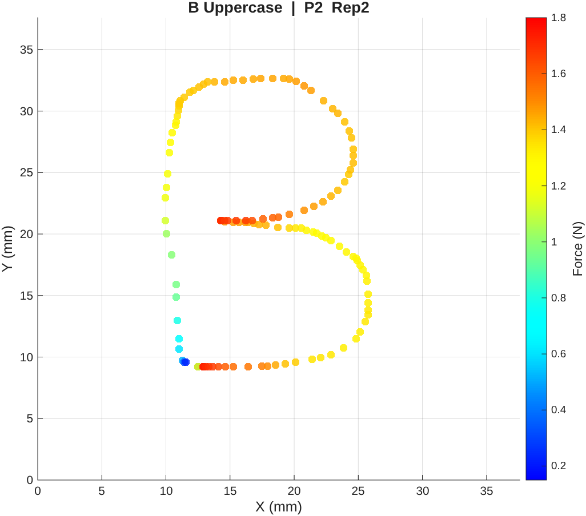
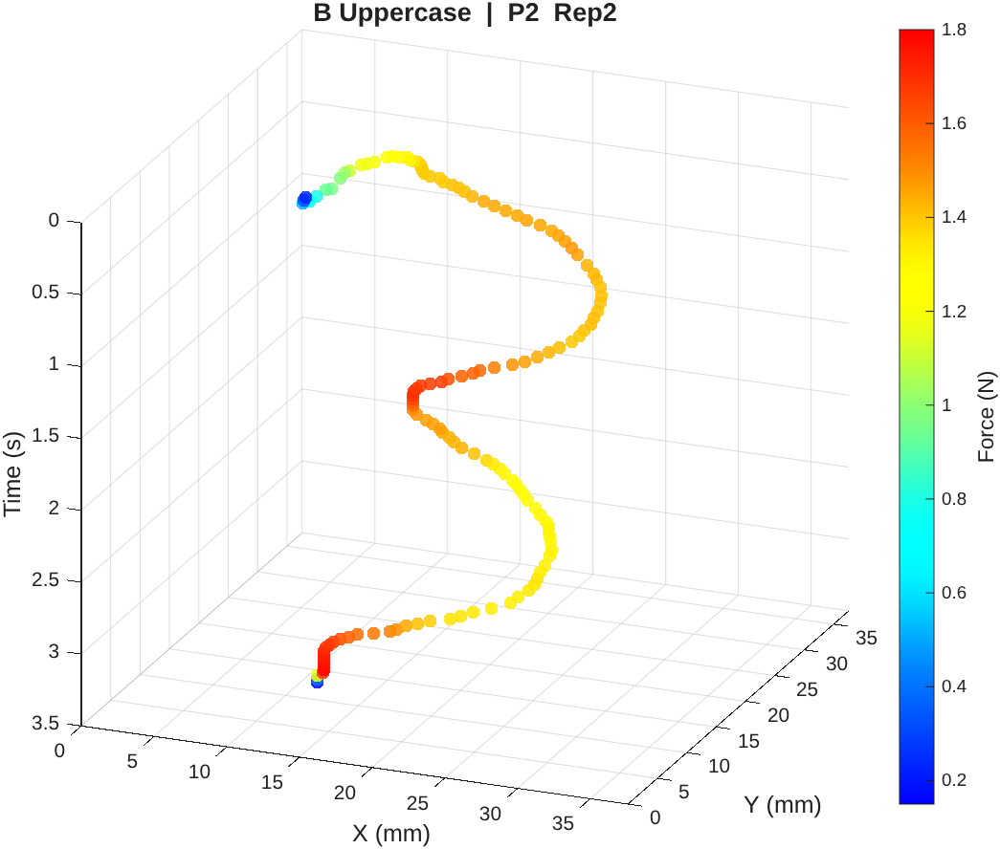

# Trajectory and Force Data for Handwritten Alphabet Generation

This repository contains a dataset of human handwriting trajectory and stylus force recordings for all 26 letters of the Latin alphabet (both uppercase and lowercase), collected through a user study on robot teleoperation via a touchscreen interface. The data is intended to support research in robot learning from demonstration, human-robot interaction (HRI), and trajectory generation for robotic handwriting tasks.

---

## Example Data Visualisations

The figures below show example recordings for the letter **A (Lowercase)**, illustrating both the planar trajectory and the 3D time-depth view. Colour encodes the applied force: **blue = minimum force**, **red = maximum force**.

**Planar view (X–Y with force colour):**



**3D view (X–Y plane facing forward, time increasing into depth):**



---

## Dataset Description

### Collection Setup
- **Interface:** Stylus-based touchscreen teleoperation interface
- **Task:** Participants traced alphabet characters (Font: Inter Regular) displayed on screen, controlling a simulated robot on a 2D surface 
- **Screen:** 13.3-inch display at 3840×2160 resolution (pixel size ≈ 0.077 mm)
- **Active workspace:** 37.59 × 37.59 mm per each square
- **Sampling Rate:** 40 Hz

### Participants
- **Total participants:** 22
- **Eligibility:** Age 18+

### Characters
- **Coverage:** Full Latin alphabet, A–Z
- **Cases:** Uppercase and Lowercase
- **Total character/case pairs:** 52 (one CSV file per pair)
- **Repetitions per participant:** Up to 3 per character (re-indexed sequentially after quality filtering)

### Data Format

Each CSV file (e.g. `A_Lowercase.csv`) contains the following columns:

| Column | Description | Unit |
|---|---|---|
| `participant` | Participant ID number | — |
| `repetition` | Repetition index (1, 2, or 3) | — |
| `x_mm` | Stylus X position on the touchscreen | mm |
| `y_mm` | Stylus Y position on the touchscreen | mm |
| `time` | Time elapsed since the start of this trial | s |
| `force_N` | Normal force applied by the stylus | N |

### Quality Filtering

All trajectories were manually inspected using an interactive MATLAB browser. Trajectories that were incomplete, misaligned, or otherwise not representative of the intended character were removed. Repetition indices were re-assigned sequentially after removal so that repetitions are always numbered 1, 2, 3 with no gaps.

---

## Dataset Statistics

The following statistics were computed across all 3,142 demonstration trajectories after quality inspection, using `Data_Analysis.m` (Section 3).

### Overview

| Metric | Value |
|---|---|
| Character/case pairs | 52 |
| Total demonstration trajectories | 3,142 |
| Average demonstrations per character | 60.4 |

### Trajectory Duration

| Mean | Std | Min | Max |
|---|---|---|---|
| 2.802 s | 1.543 s | 0.302 s | 14.674 s |

### Data Points per Trajectory

| Mean | Std | Min | Max |
|---|---|---|---|
| 95.5 | 49.5 | 13 | 360 |

### Applied Force (N)

| Mean of means | Std | Overall min | Overall max |
|---|---|---|---|
| 1.268 N | 0.572 N | 0.100 N | 5.380 N |

### Trajectory Path Length (mm)

| Mean | Std | Min | Max |
|---|---|---|---|
| 65.31 mm | 20.38 mm | 19.91 mm | 128.45 mm |

### Workspace Coverage (all trajectories combined)

| Axis | Range | Span |
|---|---|---|
| X | 3.53 – 36.11 mm | 32.59 mm |
| Y | 0.00 – 37.03 mm | 37.03 mm |

---

## How to Use `Data_Analysis.m`

### Requirements
- MATLAB (R2019b or later recommended)
- No additional toolboxes required

### Setup
1. Clone or download this repository (at least have folder Experiment_Character_Data_csv in the same location as Data_Analysis.m script)
2. Open MATLAB and set your working directory to the repository root:
3. Open `Data_Analysis.m` in the Live Editor:
   - Go to **Home → Open → Data_Analysis.m**
   - When prompted, click **"Convert"** to open as a Live Script

---

### Section 1 — Load the Data

Run Section 1 to load all 52 CSV files into a MATLAB struct called `exp_data`.

The struct is organised hierarchically:
```
exp_data
 └── <Letter>_<Case>          e.g.  exp_data.L_Lowercase
      └── P<n>_<rep>          e.g.  exp_data.L_Lowercase.P7_1
           ├── .x             X positions (mm)
           ├── .y             Y positions (mm)
           ├── .t             Time values (s)
           └── .f             Force values (N)
```

The data is cached after the first load. Re-running Section 1 skips the reload unless you first type `clear exp_data` in the Command Window.

---

### Section 2 — Browse Individual Trajectories

Edit the settings at the top of the script to select which character to inspect:

**Example — inspect all Lowercase L recordings:**

```matlab
VIS_CHARACTER = 'L';          % Any letter A–Z
VIS_CASE      = 'Lowercase';  % 'Uppercase' or 'Lowercase'
VIS_MODE      = 2;            % 1 = three 2D panels  |  2 = 3D view
```

Run Section 2 to open the interactive browser. The figure displays the selected character's trajectory coloured by applied force (blue = low force, red = high force). An info panel on the right shows per-entry statistics including duration, force range, and path length.


**To access a specific entry directly** (e.g. Participant 7, Repetition 1 of Lowercase L):
```matlab
e = exp_data.L_Lowercase.P7_1;
plot(e.x, e.y);        % 2D trajectory
figure; plot(e.t, e.f) % force over time
```

---

### Section 3 — Dataset Statistics

Run Section 3 to print a full statistical summary of the dataset to the Command Window, including:

- Per-character entry counts, mean duration, mean force, and mean path length
- Overall dataset summary (mean, std, min, max) across all trajectories
- Full workspace X/Y range

---

## Citation

If you use this dataset in your research, please cite:

```
[Citation details to be added upon publication]
```

---

## Contact

**Alperen Kenan**  
PhD Researcher, Bristol Robotics Laboratory (BRL), University of the West of England  
[Alperen.Kenan@uwe.ac.uk](mailto:Alperen.Kenan@uwe.ac.uk)  
GitHub: [kenanalperen](https://github.com/kenanalperen)
